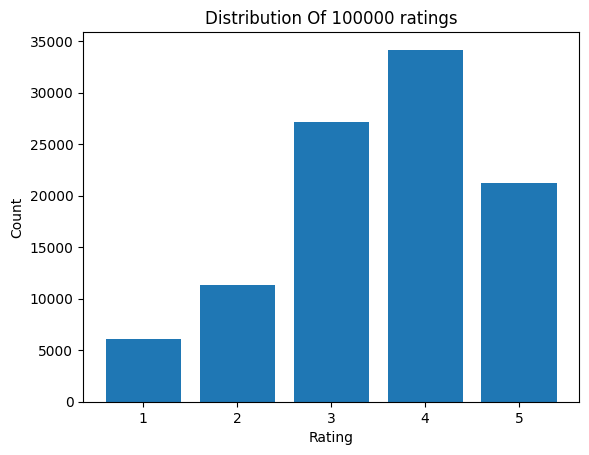
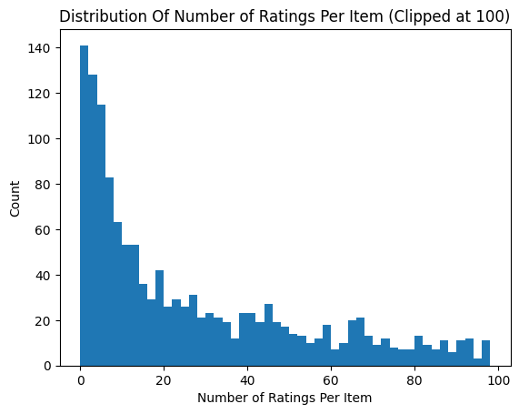
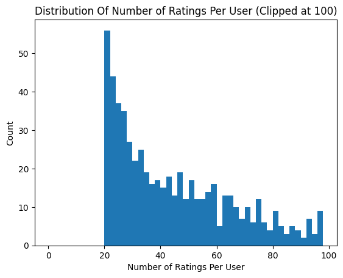

## Introduction

A recommendation system is an artificial intelligence algorithm that uses data to suggest or recommend additional products to consumers.

There are two main approches for recommendation systems:
1. Content-based recommendations: A content based recommender works with data that the user provides. Based on that data, a user profile is generated, which is then used to make suggestions to the user.
2. Collaborative Filtering: This is a more advanced system in which the algorithm tries to find similar users/articles and then recommends items based on this similarity.

I choose **Collaborative Filtering** approach.

The task of movie recommendations is a basic one, it was solved many times. Since this task is trivial, classical ML approaches can solve the task and get some useful results. I am really new to recommendation systems, so I decided not to overcomplicate things. So, **I decided to focus on classical ML approaches as a baseline**.

I explored some solution over the web and obtained research log can be found at [Notion.](https://shy-gold-119.notion.site/Research-log-4919ea17fa9046fc98cf2f476cd5eddb?pvs=4)

## Data analysis

### MovieLens 100K

During the assignment I will be using the MovieLens dataset for this purpose. It has been collected by the GroupLens Research Project at the University of Minnesota. It consists of:

- 100,000 ratings (1-5) from 943 users on 1682 movies.
- Each user has rated at least 20 movies.
- Simple demographic info for the users (age, gender, occupation, zip)
- Genre information of movies

### Data exploration

In most of the cases the rating is either neutral or slightly positive. **The data is properly distributed** and the big chunk of ratings is between 3 and 5 which means people are not very hard towards rating.



We can see that big amount of items were not rated, or have less than 20 ratings. **This may complicate the prediction for collaborative filtering**, because only connection between users and items would be used.



We can see that many users rated less than 60 films, while **the minimumn number of ratings given by a user is 20**. Therefore, by construction, this dataset allows to build prediction model based on user preferences for each user.



### Preprocessing

I decided to make it as minimal as I can, since there is no need for it for my baseline.

The one thing I did is to **remove dublicated 'movie_id'**, since pairs {'movie_id' : 'movie_title'} is not unique and some films have different id, but the same title (the film itself is the same). If film has several different ratings, the information becomes contradictory which can lead to errors.

## Model Implementation

I assume that there are no restrictions on using deep learning or models from scratch, at least your team said nothing about that.

So I will use [surprise skikit](https://surpriselib.com/) that is designed especially for recommendation system problems. \
It will help me with:
1. Dataset handling
2. Various baseline algorithms
3. Tools to evaluate, analyse and compare the algorithms’ performance

I decided to take three basic classifiers to compare them on a 3-fold cross-validation:
1. Normal Predictor: It predicts a random rating based on the distribution of the training set, which is assumed to be normal. 
2. SVD: It got popularized by Simon Funk during the Netflix prize and is a Matrix Factorized algorithm.
3. KNN Basic: This is a basic collaborative filtering algorithm method.

After cross-validation, I got that **SVD model performs the best**. Then I found the most appropriate parameters using GridSearch. 

## Model Advantages and Disadvantages

Advantages:
- Super light and simple. Easy to train and modify.
- Scalable because it uses Singular Value Decomposition (SVD) method as its basis.
- Known to be effective even for business. Netflix 1 million prize. You can [check it out](https://archive.nytimes.com/bits.blogs.nytimes.com/2009/09/21/netflix-awards-1-million-prize-and-starts-a-new-contest/).

Disadvantages:
- Uses no data about the films, like genres. That's the problem of pure collaborative filtering itself.
- Sometimes it can recommends movies which are already seen by the given input User. 

## Training Process

I used simple fit() function on training data. Since the model is super simple, it didn't take a while. Perfect!

## Evaluation

I will use [MAE](https://en.wikipedia.org/wiki/Mean_absolute_error) as accuracy metric for the predictions, that is usual for recommendation systems. Since I was using surprise scikit, I calculated it using build-in accuracy metrics with MAE.

MAE score for my model is : MAE:  0.7292

## Results

I set to list top 5 predictions and top 5 best rated films for 3 random users.


```
User id: 880

Best user ratings: 
Title: Taxi Driver (1976), genres: Drama|Thriller|
Title: Shawshank Redemption, The (1994), genres: Drama|
Title: GoodFellas (1990), genres: Crime|Drama|
Title: Sting, The (1973), genres: Comedy|Crime|
Title: Wag the Dog (1997), genres: Comedy|Drama|

Best recomendations: 
Title: Star Wars (1977), genres: Action|Adventure|Romance|Sci-Fi|War|
Title: Empire Strikes Back, The (1980), genres: Action|Adventure|Drama|Romance|Sci-Fi|War|
Title: Apocalypse Now (1979), genres: Drama|War|
Title: Schindler's List (1993), genres: Drama|War|
Title: Rear Window (1954), genres: Mystery|Thriller|

User id: 543

Best user ratings: 
Title: Usual Suspects, The (1995), genres: Crime|Thriller|
Title: Citizen Kane (1941), genres: Drama|
Title: Henry V (1989), genres: Drama|War|
Title: Bridges of Madison County, The (1995), genres: Drama|Romance|
Title: Rear Window (1954), genres: Mystery|Thriller|

Best recomendations: 
Title: Citizen Kane (1941), genres: Drama|
Title: Henry V (1989), genres: Drama|War|
Title: Graduate, The (1967), genres: Drama|Romance|
Title: Third Man, The (1949), genres: Mystery|Thriller|
Title: Rear Window (1954), genres: Mystery|Thriller|

User id: 393

Best user ratings: 
Title: Mr. Smith Goes to Washington (1939), genres: Drama|
Title: Empire Strikes Back, The (1980), genres: Action|Adventure|Drama|Romance|Sci-Fi|War|
Title: Conspiracy Theory (1997), genres: Action|Mystery|Romance|Thriller|
Title: Radioland Murders (1994), genres: Comedy|Mystery|Romance|
Title: Bye Bye, Love (1995), genres: Comedy|

Best recomendations: 
Title: Back to the Future (1985), genres: Comedy|Sci-Fi|
Title: Gandhi (1982), genres: Drama|
Title: Glory (1989), genres: Action|Drama|War|
Title: Arsenic and Old Lace (1944), genres: Comedy|Mystery|Thriller|
Title: American President, The (1995), genres: Comedy|Drama|Romance|
```
As you can see, it works :). Even film genres are similar, while I did't use information about the films. However, sometimes the system recommends films that were already rated by the user.


